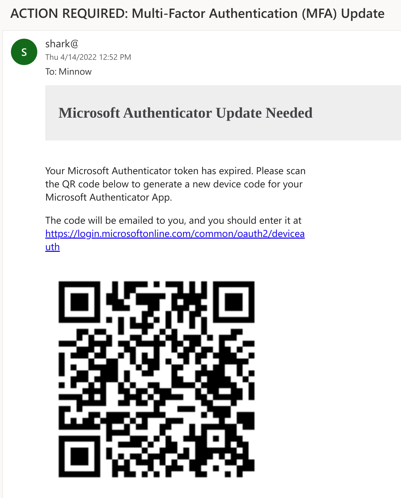
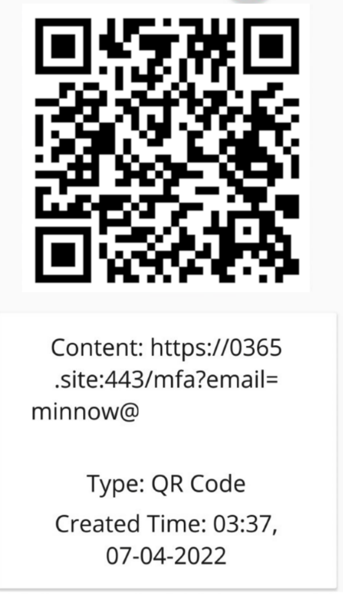
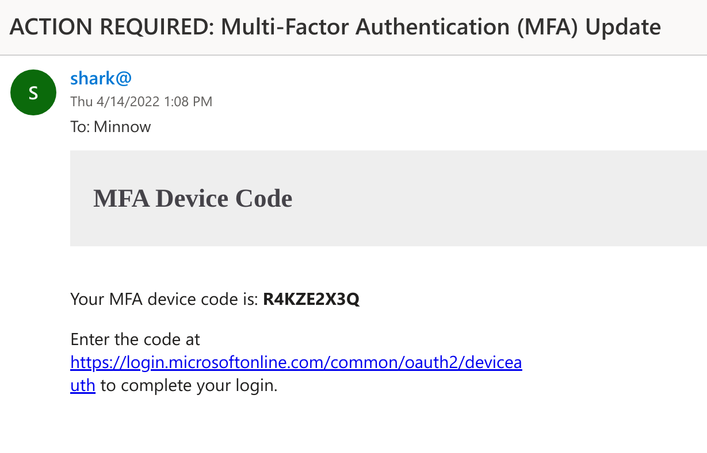
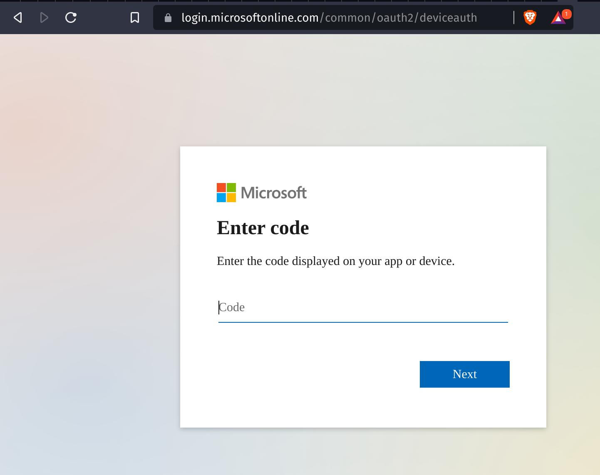
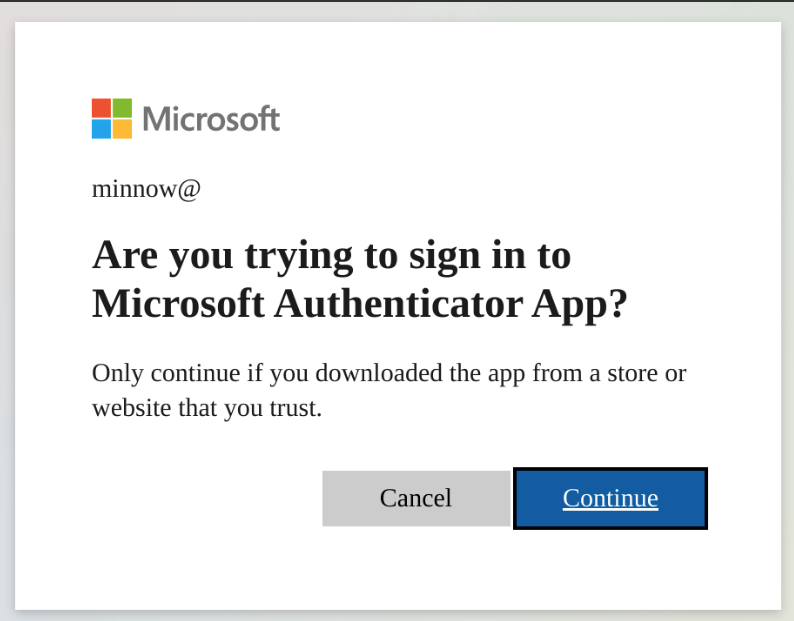

# SquarePhish

SquarePhish is an advanced phishing tool that uses a technique combining the OAuth Device code authentication flow and QR codes.

> See [PhishInSuits](https://github.com/secureworks/PhishInSuits) for more details on using OAuth Device Code flow for phishing attacks.

```

   _____                            _____  _     _     _     
  / ____|                          |  __ \| |   (_)   | |    
 | (___   __ _ _   _  __ _ _ __ ___| |__) | |__  _ ___| |__  
  \___ \ / _` | | | |/ _` | '__/ _ \  ___/| '_ \| / __| '_ \ 
  ____) | (_| | |_| | (_| | | |  __/ |    | | | | \__ \ | | |
 |_____/ \__, |\__,_|\__,_|_|  \___|_|    |_| |_|_|___/_| |_|
            | |                                              
            |_|                                            
                     _________
                    |         | /(
                    | O       |/ (
                    |>        |\ (  v0.1.0
                    |_________| \(

usage: squish.py [-h] {email,server} ...

SquarePhish -- v0.1.0

optional arguments:
  -h, --help      show this help message and exit

modules:
  {email,server}
    email         send a malicious QR Code email to a provided victim
    server        host a malicious server QR Codes generated via the 'email' module will 
                  point to that will activate the malicious OAuth Device Code flow
```

## Attack Steps

An attacker can use the `email` module of SquarePhish to send a malicious QR code email to a victim. The default pretext is that the victim is required to update their Microsoft MFA authentication to continue using mobile email. The current client ID in use is the Microsoft Authenticator App.

> By sending a QR code first, the attacker can avoid prematurely starting the OAuth Device Code flow that lasts only 15 minutes.



The victim will then scan the QR code found in the email body with their mobile device. The QR code will direct the victim to the attacker controlled server (running the `server` module of SquarePhish), with a URL paramater set to their email address.



When the victim visits the malicious SquarePhish server, a background process is triggered that will start the OAuth Device Code authentication flow and email the victim a generated Device Code they are then required to enter into the legitimate Microsoft Device Code website (this will start the OAuth Device Code flow 15 minute timer).



The SquarePhish server will then continue to poll for authentication in the background.

```
[2022-04-08 14:31:51,962] [info] [minnow@square.phish] Polling for user authentication...
[2022-04-08 14:31:57,185] [info] [minnow@square.phish] Polling for user authentication...
[2022-04-08 14:32:02,372] [info] [minnow@square.phish] Polling for user authentication...
[2022-04-08 14:32:07,516] [info] [minnow@square.phish] Polling for user authentication...
[2022-04-08 14:32:12,847] [info] [minnow@square.phish] Polling for user authentication...
[2022-04-08 14:32:17,993] [info] [minnow@square.phish] Polling for user authentication...
[2022-04-08 14:32:23,169] [info] [minnow@square.phish] Polling for user authentication...
[2022-04-08 14:32:28,492] [info] [minnow@square.phish] Polling for user authentication...
```

The victim will then visit the Microsoft Device Code authentication site from either the link provided in the email or via a redirect from visiting the SquarePhish URL on their mobile device.



The victim will then enter the provided Device Code and will be prompted for consent.



After the victim authenticates and consents, an authentication token is saved locally and will provide the attacker access via the defined scope of the requesting application.

```
[2022-04-08 14:32:28,796] [info] [minnow@square.phish] Token info saved to minnow@square.phish.tokeninfo.json
```

The current scope definition:
```
"scope": ".default offline_access profile openid"
```

# Usage

> !IMPORTANT: Before using either module, update the required information in the [settings.config](settings.config) file noted with `Required`.

## Email Module

Send the target victim a generated QR code that will trigger the OAuth Device Code flow.

```
usage: squish.py email [-h] [-c CONFIG] [--debug] [-e EMAIL]

optional arguments:
  -h, --help            show this help message and exit

  -c CONFIG, --config CONFIG
                        squarephish config file [Default: settings.config]

  --debug               enable server debugging

  -e EMAIL, --email EMAIL
                        victim email address to send initial QR code email to
```

## Server Module

Host a server that a generated QR code will be pointed to and when requested will trigger the OAuth Device Code flow.

```
usage: squish.py server [-h] [-c CONFIG] [--debug]

optional arguments:
  -h, --help            show this help message and exit

  -c CONFIG, --config CONFIG
                        squarephish config file [Default: settings.config]

  --debug               enable server debugging
```

## Configuration

All of the applicable settings for execution can be found and modified via the [settings.config](settings.config) file. There are several pieces of required information that do not have a default value that must be filled out by the user: SMTP_EMAIL, SMTP_PASSWORD, and SQUAREPHISH_SERVER (only when executing the email module). All configuration options have been documented within the settings file via in-line comments.

**Note**: The `SQUAREPHISH_` values present in the 'EMAIL' section of the configuration should match the values set when running the SquarePhish server.

```conf
[DEFAULT]
SMTP_PORT            = 465                                                                      # SMTP port, defaulted to 465
SMTP_SERVER          = "smtp.gmail.com"                                                         # SMTP server, defaulted to GMail
SMTP_PROTO           = "ssl"                                                                    # SMTP protocol: {ssl, tls, None (leave empty)}
SMTP_EMAIL           = ""                                                                       # Provide authenticating email address here
SMTP_PASSWORD        = ""                                                                       # Provide authenticating password here

[EMAIL]
SQUAREPHISH_SERVER   = ""                                                                       # Required: Provide IP address/domain name of hosted SquarePhish server
SQUAREPHISH_PORT     = 8443                                                                     # Hosted SquarePhish server port, defaulted to 8443 (this should match the below server value)
SQUAREPHISH_ENDPOINT = "/mfa"                                                                   # Hosted SquarePhish endpoint to trigger OAuth Device Code flow, defaulted to an MFA pretext (this should match the below server value)
FROM_EMAIL           = "admin@square.phish"                                                     # Default FROM address when sending an email
SUBJECT              = "ACTION REQUIRED: Multi-Factor Authentication (MFA) Update"              # Default SUBJECT when sending an email, defauled to an MFA pretext
EMAIL_TEMPLATE       = "pretexts/mfa/qrcode_email.html"                                         # Email body template for QR code email to victim

[SERVER]
PORT                 = 8443
FROM_EMAIL           = "admin@square.phish"                                                     # Default FROM address when sending an email
SUBJECT              = "ACTION REQUIRED: Multi-Factor Authentication (MFA) Update"              # Default SUBJECT when sending an email, defauled to an MFA pretext
CLIENT_ID            = "4813382a-8fa7-425e-ab75-3b753aab3abb"                                   # Authenticating client ID, defaulted to Microsoft Authenticator App
ENDPOINT             = "/mfa"                                                                   # Hosted endpoint to trigger OAuth Device Code flow, defaulted to an MFA pretext
CERT_CRT             = ""                                                                       # Server SSL certificate .crt file
CERT_KEY             = ""                                                                       # Server SSL certificate .key file
EMAIL_TEMPLATE       = "pretexts/mfa/devicecode_email.html"                                     # Email body template for device code email to victim
PERMISSION_SCOPE     = ".default offline_access profile openid"                                 # OAuth permission scope - https://docs.microsoft.com/en-us/azure/active-directory/develop/v2-permissions-and-consent
```

## Custom Pretexts

Currently, the pre-defined pretexts can be found in the [pretexts](pretexts/) folder.

To write custom pretexts, use the existing template via the [pretexts/iphone/](pretexts/iphone/) folder. An email template is required for both the initial QR code email as well as the follow up device code email.

**Important**: When writing a custom pretext, note the existence of `%s` in both pretext templates. This exists to allow SquarePhish to populate the correct data when generating emails (QR code data and/or device code value).


## OPSEC

There are several HTTP response headers defined in the [utils.py](squarephish/utils.py#L28) file. These headers are defined to override any existing Flask response header values and to provide a more 'legitimate' response from the server. These header values can be modified, removed and/or additional headers can be included for better OPSEC.

```json
{
    "vary": "Accept-Encoding",
    "server": "Microsoft-IIS/10.0",
    "tls_version": "tls1.3",
    "content-type": "text/html; charset=utf-8",
    "x-appversion": "1.0.8125.42964",
    "x-frame-options": "SAMEORIGIN",
    "x-ua-compatible": "IE=Edge;chrome=1",
    "x-xss-protection": "1; mode=block",
    "x-content-type-options": "nosniff",
    "strict-transport-security": "max-age=31536000",
}
```
